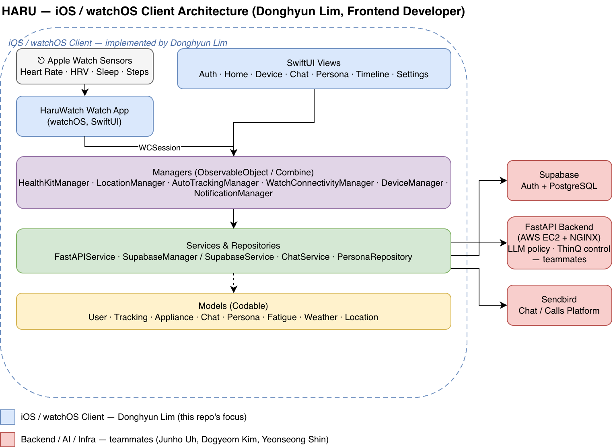

# HARU — Home Adaptive Routine Understanding

**Your Apple Watch tells the house how you feel — HARU turns HRV, sleep, and location into an LLM-driven, conversational smart-home routine.**

> This repository is a team capstone project. **This README is written from the perspective of [Donghyun Lim](https://github.com/Happ11quokka), who built the iOS / watchOS client (SwiftUI).** The AI (fatigue model, LLM policy engine) and backend (FastAPI, infra) were built by teammates — see [My Role](#my-role--ios--watchos-client-donghyun-lim) for the exact split.

[](https://swift.org)
[](https://developer.apple.com/xcode/swiftui/)
[](https://developer.apple.com/watchos/)
[](https://developer.apple.com/health-fitness/)
[](https://sendbird.com)
[](https://supabase.com)
[](https://fastapi.tiangolo.com)
[](https://openai.com)
[](./LICENSE)

---

## Overview

[](https://drive.google.com/file/d/1IWtvyqR6cUTZ7u4qVTK3rLaoMkPGpOMv/view?usp=sharing)

HARU is an intelligent smart-home automation platform that integrates wearable health data with contextual information to create a personalized and adaptive living environment. The system continuously collects real-time biometric metrics from the Apple Watch — heart rate, heart rate variability (HRV), sleep patterns, and activity levels — and estimates the user's physiological/psychological state from HRV ranges. Unlike traditional rule-based smart-home systems, HARU leverages LLM-based reasoning to interpret the user's condition and generate natural-language policies for controlling home appliances, which are then converted into structured commands to adjust lighting, temperature, humidity, and other devices automatically. By combining physiological signals with weather forecasts, GPS location, time-of-day patterns, and user preferences, HARU aims to shift the paradigm from "a user controlling a smart home" to "a home that understands the user and adapts itself."

**System workflow**
1. Apple Watch collects HRV, HR, sleep, and activity data.
2. The iOS client (this repo's focus) sends metrics to the FastAPI backend.
3. Backend estimates fatigue level from HRV ranges (teammate).
4. Context data (weather, GPS, timeslot) is integrated (teammate).
5. LLM (GPT) generates natural-language appliance-control policies (teammate).
6. Policies are parsed and executed (AC, lights, humidifier, etc.) — the iOS client renders live device state and lets the user confirm/override.
7. Actions are logged and used to update user preferences.
8. A Sendbird-powered chatbot lets the user converse with an AI persona to control devices or just chat — implemented end-to-end on the iOS client.

**Key features**
- **Wellness state from wearable HRV** — real-time HRV(SDNN)/HR/sleep/activity streaming, fatigue & stress estimated on a 1–4 scale.
- **LLM-powered appliance control** — hybrid rule-based + LLM reasoning; natural-language policies parsed into device commands.
- **Context-aware multi-modal fusion** — HRV + weather (KMA) + GPS indoor/outdoor + time-of-day + appliance logs.
- **Adaptive preference learning** — learns preferred appliance states per fatigue level over time.

## Demo

- 🎥 **Video**: https://youtu.be/I9-Sp5B4hgw
- 📝 **Blog**: https://bit.ly/44JCHlc
- App flow (from the spec doc I own — `Documentation/final/05spec_app.tex`): Splash → Social login (Email/Google/Apple/Naver/Kakao) → Home (timeline + wellness + active personas) → Appliance cards (AC / lighting / air purifier / humidifier / dehumidifier / TV, quick toggle + optimistic UI) → AI persona chat (casual conversation **or** natural-language device control, e.g. *"Make the living room cooler"*) → GPS + HRV timeline → Persona management → Settings (font size, Do-Not-Disturb, notifications, auto-tracking).

## Architecture

### System architecture (whole HARU platform — team)


### iOS / watchOS client architecture (my scope)



*Diagram authored for this README (draw.io) to document the client-side layering that isn't visible in the system-level diagram above.*

The iOS app follows a layered MVVM-ish structure:

| Layer | Components | Responsibility |
|---|---|---|
| **Views** (SwiftUI) | `Auth`, `Home`, `Device`, `Chat`, `Persona`, `Timeline`, `Settings`, `Common`, `Debug` (43 views) | Screen composition, navigation |
| **Managers** (`ObservableObject` + Combine) | `HealthKitManager`, `LocationManager`, `AutoTrackingManager`, `WatchConnectivityManager`, `DeviceManager`, `NotificationManager`, `TaggedLocationManager`, `NavigationCoordinator`, `SendbirdManager`, `SendbirdChatManager` | Sensor access, background sync, state |
| **Services / Repositories** | `FastAPIService`, `SupabaseManager` / `SupabaseService`, `ChatService`, `PersonaRepository` | REST networking, auth, business-logic bridging |
| **Models** (`Codable`) | User, Tracking, Appliance (config + backend), Chat, Persona/Character, Adjective, Fatigue, Weather, Location, Rule, Voice | Wire-format DTOs |
| **watchOS companion** | `HaruWatch Watch App` (SwiftUI + HealthKit) | On-wrist HR/step display, syncs to iPhone via `WCSession` |

## My Role — iOS / watchOS Client (Donghyun Lim)

This is a **4-person Hanyang University capstone team project** (`HARU`, team SPACE). The repository is a fork of the team's original repo (`pupwchk/SWE-G04-SPACE`); the local remote in this working copy still points at the upstream team repo (`origin` = `pupwchk/SWE-G04-SPACE`) rather than my fork, which is a pre-existing local-clone quirk I'm leaving as-is since it doesn't affect this documentation pass and I did not push anything.

Per the team's official role-assignment document (`Documentation/final/01roleassignment.tex`, `04dev_env3_Task_Distribution.tex`):

| Member | Role | Scope |
|---|---|---|
| Junho Uh | Project Manager, Backend Developer | Planning, FastAPI backend, LLM prompt/webhook logic |
| Yeonseong Shin | AI Developer | Fatigue/stress ML models, multi-agent conversation design |
| Dogyeom Kim | Backend Developer, Server Manager | FastAPI/MySQL infra, AWS EC2 deployment, CI/CD |
| **Donghyun Lim (me)** | **Frontend Developer, UI/UX Designer** | **iOS/watchOS app (SwiftUI), Figma design system** |

**What I actually built**, verified against this clone's git history (`git log --author`) and file ownership under `swift_app_demo/`:

- Owned and authored the **entire iOS/watchOS client** (`swift_app_demo/`) — 75 Swift files, ~19.6k lines, across Views/Managers/Services/Models (see [Architecture](#architecture) table).
- **56 authored commits** under this account (`limdongxian1207@gmail.com`) between Nov 6 – Dec 4, 2025 (full repo history spans 258 commits total, verified via `git log`), covering: initial app scaffolding & app-icon/splash setup, weather-API client integration, Sendbird chat + calls integration and debugging, a Supabase-auth logic fix, appliance-toggle sync fixes, push-notification implementation, a timeline "home tag" duplicate-detection bug fix, and the watch-app map version fix — plus further watchOS work (`HaruWatch Watch App`, dated Dec 26 in file headers) that is present in the working tree but not yet committed.
- **HealthKit integration**: `HealthKitManager` (739 lines) — observer queries for real-time HR/HRV/steps/calories/distance, plus 7-day historical sleep/stress/calorie aggregation.
- **Apple Watch ↔ iPhone sync**: `WatchConnectivityManager` (577 lines) using `WCSession`, plus the watchOS-side `WatchHealthManager`.
- **Background auto-tracking**: `AutoTrackingManager` (527 lines) — hourly health upload + daily sleep upload with an offline retry queue, `LocationManager` (542 lines) + `TaggedLocationManager` for GPS/geofenced "home" detection feeding the Timeline feature.
- **Backend integration layer**: `FastAPIService` (1,212 lines) and `SupabaseManager`/`SupabaseService` (1,168 lines) — REST clients (raw `URLSession`, no SDK) for auth, appliance control, and persona/chat data, talking to the teammate-owned FastAPI backend and Supabase project.
- **Conversational control UI**: `ChatService`, `SendbirdManager`, `SendbirdChatManager`, `PersonaChatView`, wiring Sendbird Chat/Calls into persona-based device control, plus `NavigationCoordinator` for push-notification deep-linking straight into a chat channel.
- **What I did *not* build**: the fatigue/stress ML model, the LLM prompt/webhook pipeline, and the FastAPI/AWS backend — those are `AI/` and `BackEnd/` and are teammates' work (see table above and their own commit history under `pupwchk`, `Junho Uh`, `Dogyeom Kim`).

**Uncommitted work found in this clone (preserved, not touched by this documentation pass):** at the time of writing there is an in-progress migration replacing an old, awkwardly-named watch target (`space Watch App Watch App`) with a cleaner `HaruWatch Watch App` target — 10 files staged for deletion, 3 new watch-app Swift files untracked, and small edits to `AppDelegate.swift` / `DeviceManager.swift` / `spaceApp.swift` / `project.pbxproj` sitting unstaged. This is earlier in-progress work of mine and has been left exactly as found (see the [git status log](#) noted in the delivery report) — nothing was committed, reset, or discarded while writing this README.

## Key Results

> Footnote on honesty: this project has no existing benchmark suite or CI. The numbers below are either **counted directly from the source tree** (labeled *measured*) or from a **smoke test I ran while preparing this README** (labeled *smoke-tested*), with real command output — nothing here is estimated or invented.

| Metric | Value | Basis |
|---|---|---|
| iOS/watchOS Swift files | 75 | *measured* — `find … -name '*.swift' \| wc -l` |
| iOS/watchOS lines of code | ~19,565 | *measured* — `wc -l` over all 75 files |
| Manager/Service layer size | 5,647 lines across 9 core files (e.g. `FastAPIService` 1,212, `SupabaseManager` 1,168, `HealthKitManager` 739) | *measured* |
| Swift syntax validity | **75 / 75 files pass** (`swiftc -parse`, 0 failures) | *smoke-tested* — real compiler invocation, see below |
| Full `xcodebuild` compile | Not completed | The project pulls three Sendbird SwiftPM packages (incl. a large WebRTC binary framework); package resolution over the network did not finish in the environment used for this README pass. Syntax-level validation above was used as the honest fallback instead of claiming an unverified build. |
| My authored commits (this clone) | 56 of 258 total repo commits (`git log --author`, Nov 6 – Dec 4, 2025) | *measured* from local git history |

<details>
<summary>Smoke-test command &amp; result (click to expand)</summary>

```
$ xcrun swiftc -parse <each of the 75 .swift files>
...
PASS=75 FAIL=0
```
</details>

## Tech Stack Rationale

| Choice | Why (iOS-side reasoning) |
|---|---|
| **SwiftUI** over UIKit | Declarative state-driven UI matched the app's heavy reliance on `@Published`/Combine state from HealthKit and network layers; faster iteration for a 5-week capstone timeline. |
| **HealthKit `HKObserverQuery`** over polling | Real-time HR/HRV updates without draining battery via a manual polling loop; matches how Apple Watch actually delivers samples. |
| **`WatchConnectivity` (`WCSession`)** over a shared backend round-trip | Lets the Watch app forward live samples to the phone with sub-second latency even without connectivity, using Apple's native transport instead of an HTTP hop through the backend. |
| **Raw `URLSession` clients (`FastAPIService`, `SupabaseManager`)** over SDKs | The team's FastAPI backend and Supabase REST surface are small and bespoke; a thin, fully-controlled HTTP layer was easier to debug against a fast-moving backend than adopting the official Supabase Swift SDK mid-project. |
| **Sendbird Chat + Calls SDKs** over building chat infra | Chat/voice/video infra (delivery guarantees, presence, push) is out of scope for a capstone timeline — Sendbird gave a production-grade channel model to attach the LLM persona to. |
| **Offline queue in `AutoTrackingManager`** | Background health/location uploads must survive Wi-Fi/cellular gaps on a phone that isn't always network-connected; a local retry queue avoids silently dropping HRV samples. |

Full project-wide stack (including teammates' backend/AI/infra choices):

| Classification | Stack |
|---|---|
| **Client (iOS / watchOS)** | SwiftUI, HealthKit, MapKit, WatchConnectivity, URLSession / async networking |
| **Backend** | Python 3.10, FastAPI (REST API), SQLAlchemy ORM, Pydantic, Docker + Docker Compose, NGINX reverse proxy, AWS EC2 (Ubuntu) |
| **Database** | Supabase (managed PostgreSQL), PostgreSQL 15 |
| **AI / Chat** | OpenAI GPT APIs, Sendbird Chat Platform |
| **External APIs** | KMA Weather API (Ultra-short-term forecast) |
| **DevOps / Tools** | Postman / Bruno (API testing), VSCode Remote SSH |

## Getting Started

These steps cover **running the iOS/watchOS client**. The FastAPI backend and AI models are teammates' components — see `BackEnd/` and `AI/` for their own setup.

```bash
git clone https://github.com/Happ11quokka/SWE-G04-SPACE.git
cd SWE-G04-SPACE/swift_app_demo
open space.xcodeproj
```

1. **Requirements**: Xcode 16+, Swift 5, iOS 18+ simulator/device, watchOS 11.5+ for the companion app.
2. **Swift Package Manager** resolves automatically on first open: `sendbird-chat-sdk-ios` (4.34.1), `sendbird-calls-ios` (1.11.1), `sendbird-webrtc-ios` (1.9.0). This can take a while on first resolve since `sendbird-webrtc-ios` ships a large binary framework.
3. **Backend endpoints** are configured in `space/Config.swift` (Sendbird app ID, Supabase URL, FastAPI base URL). ⚠️ These currently ship as **hardcoded values in source** for demo convenience — if you fork this for anything beyond a class demo, move them to an untracked `.xcconfig`/secrets file before committing further changes.
4. **HealthKit** requires a physical device (or a simulator with synthetic health data) to see live HR/HRV — the simulator has no real sensor data.
5. Select the `space` scheme for the iPhone app, or the `HaruWatch Watch App` scheme for the watch companion (currently mid-migration — see [My Role](#my-role--ios--watchos-client-donghyun-lim)).

## Group Members

| Name | Organization | Email |
|---|---|---|
| Junho Uh | Department of Information Systems, Hanyang University | djwnsgh0248@hanyang.ac.kr |
| Yeonseong Shin | Department of Data Science, Hanyang University | dustjd2651@gmail.com |
| **Donghyun Lim** | Department of Computer Science, Hanyang University | limdongxian1207@gmail.com |
| Dogyeom Kim | Department of Computer Science, Hanyang University | dogyeom74@hanyang.ac.kr |

## License

Copyright (c) 2025 HARU. This project is licensed under the MIT License — see the [LICENSE](./LICENSE) file for details.

## Links

- 🎥 Video: https://youtu.be/I9-Sp5B4hgw
- 📝 Blog: https://bit.ly/44JCHlc
- 💻 Team repo (fork source): https://github.com/pupwchk/SWE-G04-SPACE
- 💻 My fork: https://github.com/Happ11quokka/SWE-G04-SPACE
- 👤 My GitHub: https://github.com/Happ11quokka
